# Manual de Operação — Hub Advisor

> Como **alimentar o sistema de informações**, passo a passo, e o que cada passo
> **destrava**. A ordem importa: cada parte liga capacidades que as seguintes
> aproveitam. Alimentar fora de ordem deixa recursos "apagados".
>
> Use os **checkboxes** como checklist de implantação (marque `[x]` ao concluir).
>
> ⏱️ **Com pressa?** Veja o **[Primeiros 30 minutos](./primeiros-30-min.md)** — só o
> caminho mínimo até a primeira venda. Este documento é a referência completa.
>
> 📄 **Para imprimir/entregar à equipe:** [manual-operacao.pdf](./manual-operacao.pdf)
> (gerado deste mesmo conteúdo — `npm run docs:pdf`).

## Índice

- [Legenda de status](#legenda-de-status)
- [Painel de integrações (status atual)](#painel-de-integrações--o-que-ligar-e-status-atual)
- [Mapa completo — as 14 partes](#mapa-completo-as-partes)
- **Partes 1 a 14** (cada uma com "o que fazer → o que destrava")
- [Glossário](#glossário) — o que cada termo significa
- [Papéis e permissões](#papéis-e-permissões) — quem pode o quê
- [Perguntas frequentes (FAQ)](#perguntas-frequentes-faq)
- [Primeiros 30 minutos](./primeiros-30-min.md) *(documento separado)*

## Legenda de status

| Badge | Significado |
|-------|-------------|
| 🟢 **LIVE** | Já conectado e funcionando na sua produção. |
| 🟡 **Aguardando credencial** | Implementado; roda em **modo mock** (simulado) até você plugar a credencial. |
| ⚪ **Opcional / avançado** | Liga só se fizer sentido pro seu caso. |
| ☐ / ☑ | Passo do checklist de implantação. |

> O **modo mock** (`USE_MOCK_CONNECTORS`) faz o sistema simular qualquer
> integração ainda não conectada — você testa o fluxo inteiro antes de plugar o real.

## Painel de integrações — o que ligar (e status atual)

<!-- INTEGRACOES:START -->
> Gerado automaticamente do status real da loja **thepop7** em 2026-05-31 (`scripts/gen-status.mjs`).

| Integração | Onde ligar | Credencial / env no servidor | Status |
|-----------|-----------|------------------------------|--------|
| **Anthropic Claude (IA)** | Configurações | `ANTHROPIC_API_KEY` | 🟢 LIVE |
| **WhatsApp Business Cloud** | Configurações → WhatsApp | `WHATSAPP_PHONE_NUMBER_ID`, `WHATSAPP_ACCESS_TOKEN`, `META_WEBHOOK_VERIFY_TOKEN` | 🟡 Aguardando |
| **Instagram / Facebook** | Configurações → Instagram | `INSTAGRAM_ACCESS_TOKEN`, `META_APP_ID`, `META_APP_SECRET` | 🟡 Aguardando |
| **Mercado Pago (pagamento)** | Configurações → Mercado Pago | `MERCADOPAGO_ACCESS_TOKEN` | 🟡 Aguardando |
| **Melhor Envio (frete)** | Configurações → Melhor Envio | `MELHORENVIO_ACCESS_TOKEN` | 🟡 Aguardando |
| **Tray Commerce (ERP)** | Configurações → Tray | `ERP_PROVIDER=tray`, `TRAY_CONSUMER_KEY/SECRET`, `TRAY_ACCESS_TOKEN` | 🟡 Aguardando |
| **CPlug (NFe / fiscal)** | Configurações → CPlug | `FISCAL_PROVIDER=cplug`, `CPLUG_*` | 🟡 Aguardando |
| **SMS (Zenvia)** | Configurações → SMS | `ZENVIA_TOKEN`, `ZENVIA_FROM` | 🟡 Aguardando |
| **Lalamove (entregador on-demand)** | Configurações → Lalamove | `LALAMOVE_API_KEY/SECRET`, `LALAMOVE_MARKET` | ⚪ Opcional |
| **Open Delivery (entregador)** | Configurações → Open Delivery | `OPENDELIVERY_BASE_URL`, `OPENDELIVERY_CLIENT_*` | ⚪ Opcional |
<!-- INTEGRACOES:END -->

**Outras (configuração só no servidor):**

| Integração | Onde ligar | Credencial / env no servidor | Status |
|-----------|-----------|------------------------------|--------|
| **Mídia paga (Meta Ads)** | Mídia paga | `META_ADS_ACCESS_TOKEN`, `META_AD_ACCOUNT_ID` | 🟡 Aguardando |
| **E-mail (Resend)** | servidor | `RESEND_API_KEY`, `EMAIL_FROM`, `EMAIL_INBOUND_DOMAIN` | 🟡 Aguardando |
| IA de reserva (fallback) | servidor | `GROQ_API_KEY` / `OLLAMA_URL` | ⚪ Opcional |
| Busca semântica (embeddings) | servidor | `VOYAGE_API_KEY` | ⚪ Opcional |

> **Pendências conhecidas da sua loja:** (1) retomar a credencial **Tray**
> (`www.thepop7.com.br`, CK `02409974414`); (2) setar `META_WEBHOOK_VERIFY_TOKEN`
> no Railway para validar o webhook do WhatsApp.

## Mapa completo (as partes)

| # | Parte | O que essa camada liga |
|---|-------|------------------------|
| 1 | **Fundação** — conta, tipo de negócio, identidade, IA | A loja existe, fala a sua língua e a IA entra no ar |
| 2 | **Canais de conversa** — WhatsApp, Instagram, Facebook | Clientes te chamam e a IA responde |
| 3 | **Catálogo & estoque** — produtos, variantes, etiquetas, peças | A IA tem o que vender e você controla o que tem |
| 4 | **Pagamento & entrega** — Mercado Pago, Melhor Envio, retirada, entregadores | O pedido vira dinheiro e chega no cliente |
| 5 | **Atendimento & pedidos** — Inbox, aprovação, ciclo do pedido | O dia a dia da venda assistida |
| 6 | **Fidelidade & marketing** — cashback, promoções, recompra, mídia paga | Cliente volta e você atrai novos |
| 7 | **Pós-venda & satisfação** — Lia, NPS/detrator | Cliente bem cuidado depois da entrega |
| 8 | **Clientes & perfis** — CRM, tags de perfil | A IA trata cada cliente do jeito certo |
| 9 | **Compras & mercadológica** — fornecedores, cotação de preços | Você compra melhor |
| 10 | **Financeiro** — fluxo de caixa, contas, DRE | Você enxerga o caixa |
| 11 | **Fiscal & ERP** — Tray, CPlug/NFe | Nota fiscal e integração com gestão |
| 12 | **Fabricação** *(opcional)* — insumos, fichas técnicas, produção | Para quem produz o que vende |
| 13 | **Equipe & governança** — papéis, LGPD, identidades cross-canal | Controle de acesso e conformidade |
| 14 | **Painel de TV** — wallboard ao vivo | Monitorar a operação do dia numa TV |

---

## Parte 1 — Fundação

> Sair do zero para uma loja que **existe, fala a sua língua e tem a IA pronta**.

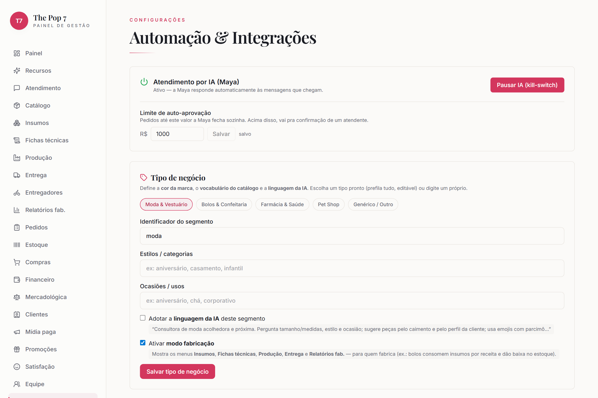

### 1.1 Criar a loja (signup)
- [ ] Tela de entrada → "Criar loja" → nome da loja, seu nome, e-mail e senha (gera o *slug*).

**Destrava:** espaço **isolado** (dados nunca se misturam com outra loja) e seu usuário como **dono (owner)**, com acesso total.

🖱️ Passo a passo

<ol>
<li>Acesse o endereço do sistema no navegador.</li>
<li>Clique em <b>"Criar loja"</b>.</li>
<li>Preencha <b>nome da loja</b>, <b>seu nome</b>, <b>e-mail</b> e <b>senha</b>.</li>
<li>Clique em <b>"Criar"</b> — você entra já como <b>dono</b>.</li>
</ol>

### 1.2 Tipo de negócio
- [ ] **Configurações → Tipo de negócio** → escolher o segmento (moda, alimentação, genérico…).

**Destrava (passo mais alavancado do início):** vocabulário do catálogo na sua língua • **voz da IA** no tom do segmento • busca visual ciente do segmento • mostra/oculta o módulo **Fabricação**.

🖱️ Passo a passo

<ol>
<li>No menu lateral, clique em <b>Configurações</b>.</li>
<li>Role até o card <b>"Tipo de negócio"</b>.</li>
<li>Clique no seu segmento — ex.: <b>Moda &amp; Vestuário</b>.</li>
<li>(Opcional) preencha <b>Estilos/categorias</b> e <b>Ocasiões</b>.</li>
<li>Clique em <b>"Salvar tipo de negócio"</b>.</li>
</ol>

### 1.3 Identidade da loja (marca e endereço)
- [ ] Conferir a cor/marca (vem do segmento).
- [ ] **Configurações → Retirada na loja** → preencher o **endereço da loja**.

**Destrava:** endereço **visível à IA** (a Maya diz onde buscar + envia **link do Google Maps**) e habilita **retirada na loja** (frete R$ 0, sem CEP).

🖱️ Passo a passo

<ol>
<li>No menu lateral, clique em <b>Configurações</b>.</li>
<li>Role até o card <b>"Retirada na loja"</b>.</li>
<li>Digite o <b>endereço completo</b> da loja.</li>
<li>Clique em <b>"Salvar"</b>. (A cor/marca já vem do segmento.)</li>
</ol>

### 1.4 Ligar a IA — 🟢 LIVE
- [ ] Confirmar **Anthropic (Claude)** ativa (já está em produção).
- [ ] Ativar o toggle **"Atendimento por IA (Maya)"**.
- [ ] Definir o **teto de pedido automático**.

**Destrava:** a **Maya responde sozinha** às mensagens; o **teto** define até quanto ela fecha sem olho humano.

🖱️ Passo a passo

<ol>
<li>No menu lateral, clique em <b>Configurações</b>.</li>
<li>No topo, no card <b>"Atendimento por IA (Maya)"</b>, deixe o botão em <b>Ativo</b>.</li>
<li>No campo <b>"Pedidos até R$…"</b>, defina o <b>teto de auto-aprovação</b>.</li>
<li>Clique em <b>"Salvar"</b>.</li>
</ol>

✅ **Ao fim:** loja isolada, IA no tom certo, sabendo o endereço — falta abrir canais (Parte 2) e dar produtos (Parte 3).

---

## Parte 2 — Canais de conversa

> Abrir as portas por onde o cliente chega. Sem canal, a IA está pronta mas muda.

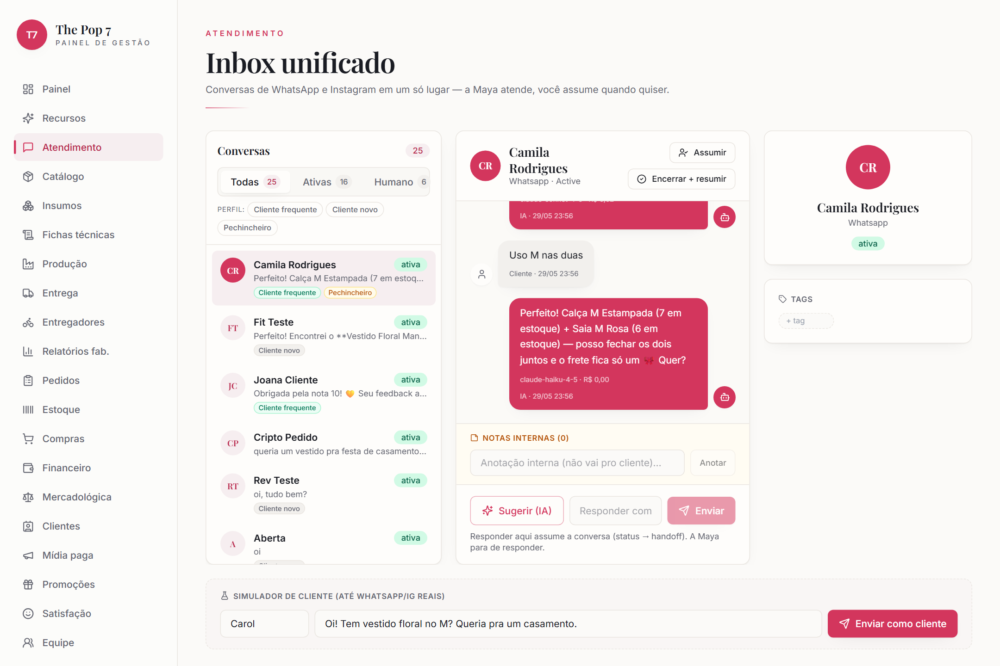

### 2.1 WhatsApp Business Cloud — 🟡 Aguardando credencial
- [ ] **Configurações → WhatsApp Business Cloud API** → conectar.
- [ ] No servidor: `WHATSAPP_PHONE_NUMBER_ID`, `WHATSAPP_ACCESS_TOKEN`, `META_WEBHOOK_VERIFY_TOKEN`.

**Destrava:** Maya respondendo 24/7 no WhatsApp • **auto-cadastro** do contato com nome do perfil • libera todos os envios ativos (cashback, recompra, pós-venda, aviso de entregador).

🖱️ Passo a passo

<ol>
<li>Configurações → card <b>"WhatsApp Business Cloud API"</b>.</li>
<li>Clique em <b>"Configurar"</b> e cole o <b>Phone Number ID</b> e o <b>Access Token</b> (do Meta).</li>
<li>Clique em <b>"Salvar"</b>. No servidor (Railway), defina o <b>META_WEBHOOK_VERIFY_TOKEN</b>.</li>
<li>Mande uma mensagem de teste para o número — a Maya responde.</li>
</ol>

### 2.2 Instagram Graph API — 🟡 Aguardando credencial
- [ ] **Configurações → Instagram Graph API** → conectar a conta profissional (`INSTAGRAM_ACCESS_TOKEN`).

**Destrava:** DM do Instagram no mesmo Inbox + **nome real** do perfil no CRM (degrada para só o id se faltar token).

🖱️ Passo a passo

<ol>
<li>Configurações → card <b>"Instagram Graph API"</b>.</li>
<li>Clique em <b>"Configurar"</b> e cole o <b>Access Token</b> da conta profissional.</li>
<li>Clique em <b>"Salvar"</b>. As DMs passam a cair no <b>Atendimento</b>.</li>
</ol>

### 2.3 Facebook / Messenger — 🟡 Aguardando credencial
- [ ] Vincular a página (mesmo fluxo Meta: `META_APP_ID`, `META_APP_SECRET`).

**Destrava:** mais um canal unificado, com o mesmo cérebro de IA e CRM.

🖱️ Passo a passo

<ol>
<li>Configurações → seção <b>Meta</b> (mesma do Instagram).</li>
<li>Vincule a <b>página</b> (App ID/Secret do Meta).</li>
<li>Clique em <b>"Salvar"</b>.</li>
</ol>

✅ **Ao fim:** todos os canais caem num **Inbox único** e cada cliente já entra no CRM.

---

## Parte 3 — Catálogo & estoque

> Dar à IA **o que vender** e a você **o controle do que tem**.

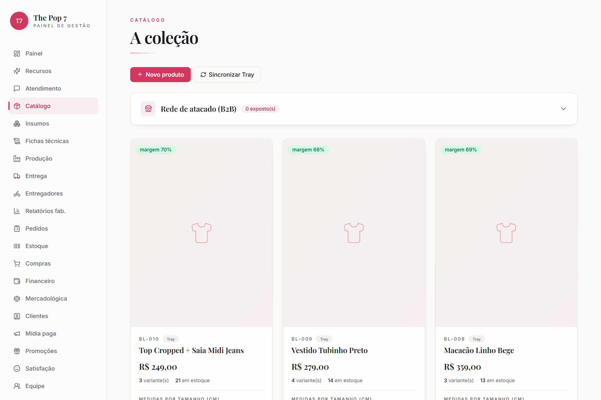
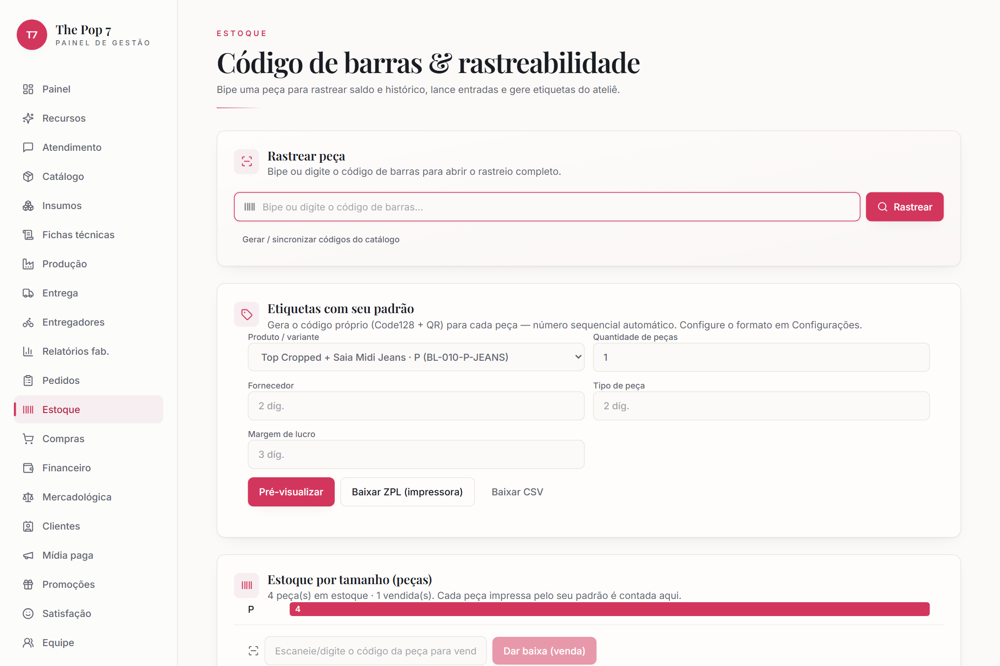

### 3.1 Cadastrar produtos e variantes
- [ ] **Catálogo → Novo produto** → nome, preço, custo, **variantes** (SKU, tamanho/cor, estoque). Ou importar do ERP (Parte 11), ou usar o **extrator por foto/texto**.

**Destrava:** a **Maya passa a vender** com preço e estoque reais; estoque por variante alimenta reservas e baixa automática.

🖱️ Passo a passo

<ol>
<li>No menu lateral, clique em <b>Catálogo</b>.</li>
<li>Clique em <b>"Novo produto"</b>.</li>
<li>Preencha <b>nome</b>, <b>preço</b> e <b>custo</b>.</li>
<li>Adicione as <b>variantes</b> (SKU, tamanho/cor, estoque).</li>
<li>Clique em <b>"Salvar"</b>. (Ou use o <b>extrator por foto/texto</b> para preencher sozinho.)</li>
</ol>

### 3.2 Padrão de código próprio (etiquetas)
- [ ] **Configurações → Padrão de código (etiquetas)** → montar o formato por segmentos. Ex.: `26030104159030-0001-PP` (ou "usar sugestão de roupas").

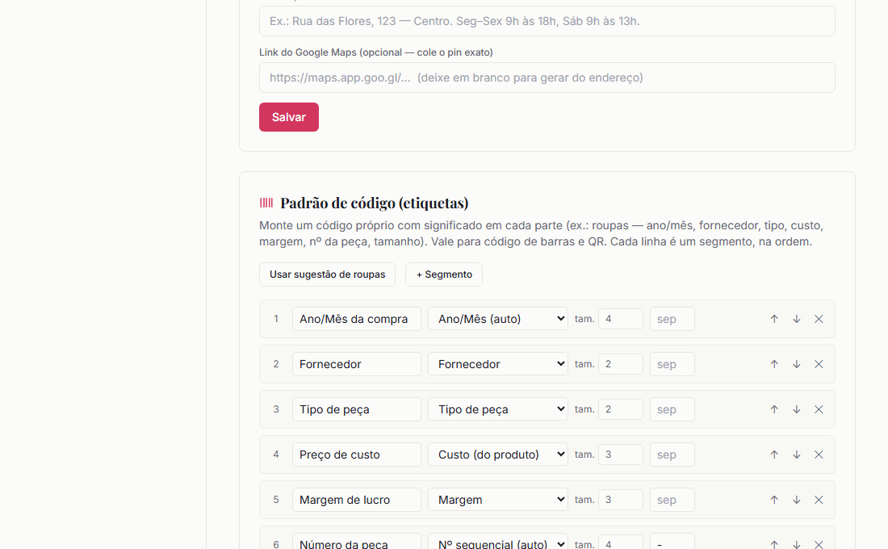

**Destrava:** código de barras/QR **com significado** (dá pra ler a etiqueta a olho) e base para o registro peça a peça.

🖱️ Passo a passo

<ol>
<li>Configurações → card <b>"Padrão de código (etiquetas)"</b>.</li>
<li>Monte os <b>segmentos</b> (significado + tamanho) ou clique em <b>"Usar sugestão de roupas"</b>.</li>
<li>Confira a <b>prévia</b> do código ao vivo.</li>
<li>Clique em <b>"Salvar padrão"</b>.</li>
</ol>

### 3.3 Gerar/imprimir etiquetas e registrar peças
- [ ] **Estoque → Etiquetas com seu padrão** → variante + quantidade → pré-visualizar → baixar (ZPL para impressora térmica, ou CSV).

**Destrava:** **estoque por tamanho contado peça a peça** (cada etiqueta = uma peça única) e **baixa por leitura de código** na venda.

🖱️ Passo a passo

<ol>
<li>No menu lateral, clique em <b>Estoque</b>.</li>
<li>Card <b>"Etiquetas com seu padrão"</b>.</li>
<li>Escolha a <b>variante</b> e a <b>quantidade</b>.</li>
<li>Clique em <b>"Pré-visualizar"</b> e depois <b>"Baixar"</b> (ZPL p/ impressora térmica ou CSV).</li>
<li>Na venda, leia o código no campo <b>"código da peça"</b> e clique <b>"Dar baixa"</b>.</li>
</ol>

✅ **Ao fim:** catálogo vivo + etiquetas no seu padrão + contagem física por tamanho.

---

## Parte 4 — Pagamento & entrega

> Transformar conversa em **dinheiro** e fazer o produto **chegar**.

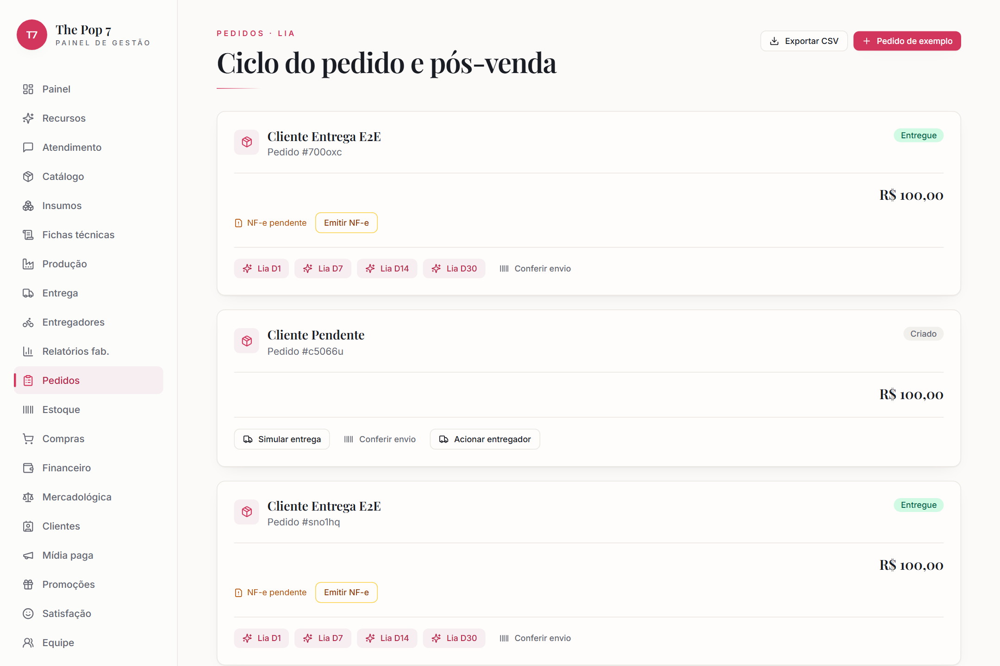

### 4.1 Mercado Pago (pagamento) — 🟡 Aguardando credencial
- [ ] **Configurações → Mercado Pago** → conectar (`MERCADOPAGO_ACCESS_TOKEN`).

**Destrava:** IA **gera PIX/cobrança** e, no "pago", dispara automaticamente: baixa de estoque, NFe (se fiscal ligado), **cashback** e a receita no Financeiro.

🖱️ Passo a passo

<ol>
<li>Configurações → card <b>"Mercado Pago"</b>.</li>
<li>Clique em <b>"Conectar"</b> e autorize sua conta (ou cole o Access Token).</li>
<li>Clique em <b>"Salvar"</b>. A IA passa a gerar <b>PIX</b> nas conversas.</li>
</ol>

### 4.2 Melhor Envio (frete) — 🟡 Aguardando credencial
- [ ] **Configurações → Melhor Envio** → conectar (`MELHORENVIO_ACCESS_TOKEN`).

**Destrava:** **cálculo de frete e prazo** reais na conversa + etiqueta de envio.

🖱️ Passo a passo

<ol>
<li>Configurações → card <b>"Melhor Envio"</b>.</li>
<li>Clique em <b>"Conectar"</b> (ou cole o Access Token) e <b>"Salvar"</b>.</li>
</ol>

### 4.3 Retirada na loja — 🟢 (habilitada no 1.3)
- [ ] Conferir o endereço preenchido.

**Destrava:** alternativa **sem frete e sem CEP** — a IA oferece "retirar na loja".

🖱️ Passo a passo

<ol>
<li>Configurações → card <b>"Retirada na loja"</b>.</li>
<li>Confirme o <b>endereço</b> preenchido (passo 1.3).</li>
<li>Pronto — a IA oferece <b>"retirar na loja"</b> (frete R$ 0, sem CEP).</li>
</ol>

### 4.4 Entregadores próprios (interior) — 🟢 nativo
- [ ] **Entregadores → Novo entregador** (gera o **link do app** do entregador).
- [ ] Em cada pedido, **Acionar entregador**.

**Destrava:** pessoas da cidade recebem corridas no **app por link** (mobile, sem login) • aviso por WhatsApp ao atribuir • a **taxa vira despesa automática** no Financeiro ao entregar.

🖱️ Passo a passo

<ol>
<li>No menu lateral, <b>Entregadores</b> → aba <b>"Entregadores"</b>.</li>
<li>Clique <b>"Novo entregador"</b> → digite o <b>nome</b> → <b>"Cadastrar"</b>.</li>
<li>Copie o <b>link do app</b> e envie ao entregador (WhatsApp).</li>
<li>Em <b>Pedidos</b>, num pedido, clique <b>"Acionar entregador"</b> e escolha a pessoa.</li>
</ol>

### 4.5 Entregador on-demand (Lalamove / Open Delivery) — ⚪ Opcional
- [ ] **Configurações → Lalamove / Open Delivery** → conectar (se usar terceirizado).

**Destrava:** despacho de entrega **terceirizada** quando não há entregador próprio livre.

🖱️ Passo a passo

<ol>
<li>Configurações → card <b>"Lalamove"</b> ou <b>"Open Delivery"</b>.</li>
<li>Cole as credenciais do parceiro e clique <b>"Salvar"</b>.</li>
<li>Em <b>Pedidos</b>, <b>"Acionar entregador"</b> usa o parceiro quando não há próprio livre.</li>
</ol>

✅ **Ao fim:** o ciclo financeiro e logístico fecha sozinho a partir do "pago".

---

## Parte 5 — Atendimento & pedidos

> O **dia a dia** da venda assistida por IA com supervisão humana.

### 5.1 Inbox (Atendimento)
- [ ] **Atendimento** → acompanhar conversas (todos os canais), com data/hora por mensagem, divisórias por dia e rótulo de quem falou.
- [ ] Usar **Notas internas** (fixar/apagar) e o **filtro por perfil do cliente**.

**Destrava:** visão única; **assumir manualmente** quando quiser (a IA recua); notas = memória do time invisível ao cliente.

🖱️ Passo a passo

<ol>
<li>No menu lateral, clique em <b>Atendimento</b>.</li>
<li>Clique numa conversa para abri-la.</li>
<li>Para responder você mesmo, digite e envie (a IA recua = você <b>assumiu</b>).</li>
<li>Use as <b>Notas internas</b>: campo "Anotação interna" → <b>"Anotar"</b> (dá para fixar/apagar).</li>
<li>Filtre as conversas pelo <b>perfil do cliente</b>.</li>
</ol>

### 5.2 Aprovar pedidos pendentes
- [ ] **Pedidos** → pedidos acima do teto aparecem como **"Aguardando aprovação"** → **"Aprovar e gerar PIX"**.

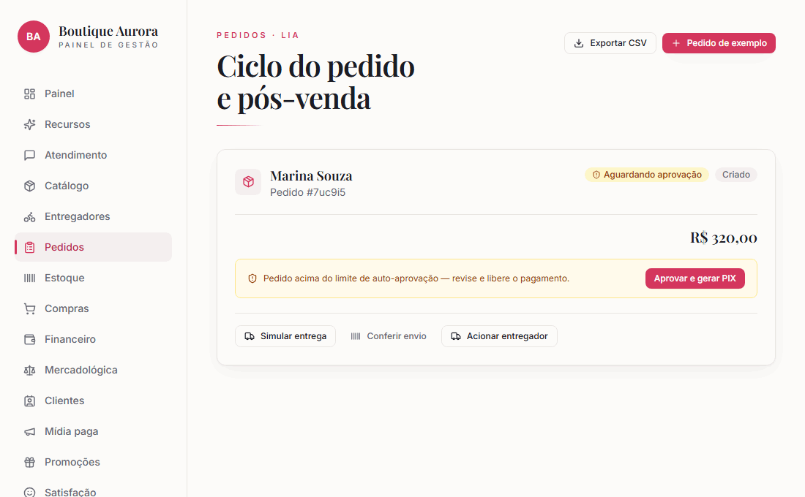

**Destrava:** controle humano nas vendas de maior valor, sem travar as pequenas.

🖱️ Passo a passo

<ol>
<li>No menu lateral, clique em <b>Pedidos</b>.</li>
<li>Localize o pedido com o aviso <b>"Aguardando aprovação"</b>.</li>
<li>Clique <b>"Aprovar e gerar PIX"</b> — a cobrança é criada e enviada ao cliente.</li>
</ol>

### 5.3 Ciclo do pedido
- [ ] Acompanhar **pago → separação → enviado → em trânsito → entregue** (há **"Simular entrega"** para testar).

**Destrava:** rastreamento de cada venda e os gatilhos automáticos por etapa (estoque, NFe, pós-venda).

🖱️ Passo a passo

<ol>
<li>Em <b>Pedidos</b>, abra o pedido.</li>
<li>Acompanhe o <b>status</b> (pago → separação → enviado → em trânsito → entregue).</li>
<li>Para testar o fluxo sem cliente real, clique <b>"Simular entrega"</b>.</li>
</ol>

✅ **Ao fim:** você opera com a IA na linha de frente e você no controle do que importa.

---

## Parte 6 — Fidelidade & marketing

> Fazer o cliente **voltar** e **atrair** novos.

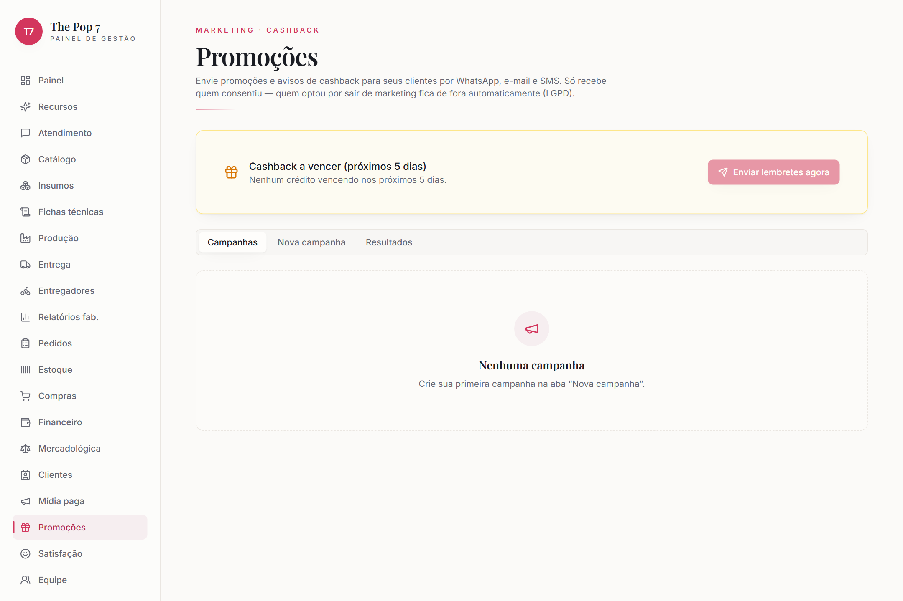

### 6.1 Cashback (fidelidade) — 🟢 nativo
- [ ] **Configurações → Cashback (fidelidade)** → ativar e definir o %.

**Destrava:** acúmulo automático a cada compra paga + a **Maya avisa o saldo** para incentivar a volta.

🖱️ Passo a passo

<ol>
<li>Configurações → card <b>"Cashback (fidelidade)"</b>.</li>
<li>Marque <b>Ativo</b> e defina o <b>percentual (%)</b>.</li>
<li>Clique em <b>"Salvar"</b>.</li>
</ol>

### 6.2 Promoções (disparos)
- [ ] **Promoções → Nova campanha** → mensagem + público + canal (WhatsApp/SMS) → enviar ou salvar rascunho.

**Destrava:** **broadcast** segmentado (ex.: cashback vencendo) + histórico com resultado. *(SMS exige Zenvia 🟡.)*

🖱️ Passo a passo

<ol>
<li>No menu lateral, clique em <b>Promoções</b>.</li>
<li>Clique no botão <b>"Nova campanha"</b>.</li>
<li>Digite o <b>título</b> e a <b>mensagem</b>.</li>
<li>Escolha o <b>canal</b> (WhatsApp já vem marcado) e o <b>público</b>.</li>
<li><b>"Salvar rascunho"</b> (guardar) ou <b>"Enviar agora"</b> (disparar).</li>
</ol>

### 6.3 Recompra automática (winback) — 🟢 nativo
- [ ] **Configurações → Recompra automática** → ativar e definir "inativo há (dias)". Botão **"Enviar agora"** roda na hora.

**Destrava:** reativação **automática semanal** de quem comprou e sumiu (respeita opt-out; máx. a cada 30 dias por cliente).

🖱️ Passo a passo

<ol>
<li>Configurações → card <b>"Recompra automática"</b>.</li>
<li>Marque <b>Ativo</b> e defina <b>"Inativo há (dias)"</b>.</li>
<li>Clique <b>"Salvar"</b> (roda 1x/semana) ou <b>"Enviar agora"</b> para disparar na hora.</li>
</ol>

### 6.4 Mídia paga — 🟡 Aguardando credencial
- [ ] **Mídia paga** → conectar Meta Ads (`META_ADS_ACCESS_TOKEN`, `META_AD_ACCOUNT_ID`) → criar campanha com **públicos do CRM** (a IA gera o criativo).

**Destrava:** anúncios pagos alimentados pelos seus clientes, com **ROAS**.

🖱️ Passo a passo

<ol>
<li>No menu lateral, clique em <b>Mídia paga</b>.</li>
<li>Conecte o <b>Meta Ads</b> (token + ID da conta de anúncios).</li>
<li>Clique <b>"Nova campanha"</b> e escolha um <b>público do CRM</b>.</li>
<li>A IA gera o <b>criativo</b>; revise e publique. Acompanhe o <b>ROAS</b> na tela.</li>
</ol>

✅ **Ao fim:** as máquinas de retenção e aquisição rodando.

---

## Parte 7 — Pós-venda & satisfação

> Cuidar do cliente **depois** da entrega — onde se ganha a recompra.

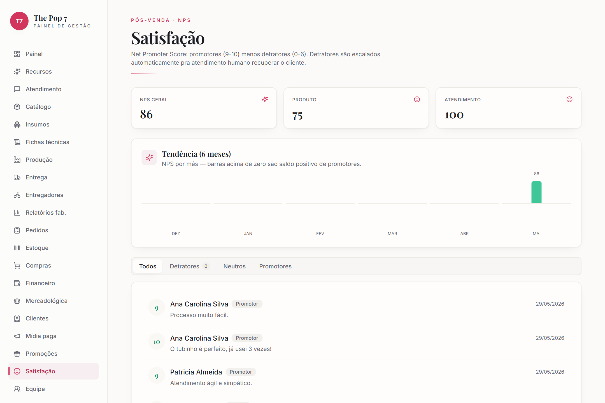

### 7.1 Pós-venda da Lia — 🟢 nativo
- [ ] Conferir que ao entregar a **Lia** agenda marcos **D+1 / D+7 / D+14 / D+30** (ou dispare manual em Pedidos).

**Destrava:** mensagens proativas no tempo certo (chegou bem? gostou? hora de repor?).

🖱️ Passo a passo

<ol>
<li>Não precisa fazer nada: quando um pedido é <b>entregue</b>, a Lia agenda D+1/D+7/D+14/D+30 sozinha.</li>
<li>Para disparar na hora: <b>Pedidos</b> → no pedido entregue, clique <b>"Lia D1/D7/D14/D30"</b>.</li>
</ol>

### 7.2 NPS & recuperação de detrator
- [ ] **Satisfação** → acompanhar notas (promotor/neutro/detrator) e comentários.

**Destrava:** termômetro de NPS por produto e atendimento; **detrator escalado automaticamente** para atendimento humano recuperar o cliente.

🖱️ Passo a passo

<ol>
<li>No menu lateral, clique em <b>Satisfação</b>.</li>
<li>Veja o <b>NPS</b> (geral/produto/atendimento) e os comentários.</li>
<li>Filtre por <b>"Detratores"</b> — eles já foram encaminhados a um humano para recuperar.</li>
</ol>

✅ **Ao fim:** o relacionamento não acaba na entrega.

---

## Parte 8 — Clientes & perfis

> Fazer a IA **tratar cada cliente do jeito certo**.

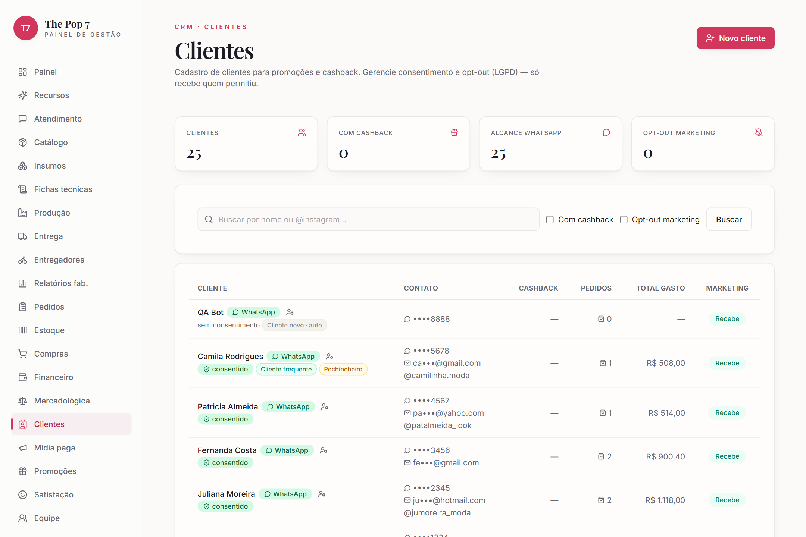

### 8.1 CRM (Clientes)
- [ ] **Clientes** → conferir os contatos (vindos dos canais), com canal de origem e histórico.

**Destrava:** base única para promoções, recompra, mídia paga e atendimento.

🖱️ Passo a passo

<ol>
<li>No menu lateral, clique em <b>Clientes</b>.</li>
<li>Busque por <b>nome/@instagram</b> ou use os filtros (opt-out, com cashback).</li>
<li>Para cadastrar manualmente: <b>"Novo cliente"</b> → nome + 1 contato (+ endereço) → <b>"Cadastrar"</b>.</li>
</ol>

### 8.2 Perfil/classificação do cliente — 🟢 nativo
- [ ] **Clientes → ⚙ Perfil do cliente** → marcar tags: *frequente, novo, pechincheiro, problemático, atenção humana, banido*.

**Destrava:** **tom** ajustado por perfil • *atenção humana* → encaminha já • *banido* → IA não responde • classificação **automática** de *novo* (0 pedidos) e *frequente* (≥3).

🖱️ Passo a passo

<ol>
<li>Em <b>Clientes</b>, clique no ícone <b>⚙ (Perfil do cliente)</b> ao lado do nome.</li>
<li>Marque as <b>tags</b> (frequente, pechincheiro, problemático, atenção humana, banido…).</li>
<li>As mudanças salvam sozinhas. (<b>Novo</b> e <b>Frequente</b> são automáticos pelos pedidos.)</li>
</ol>

✅ **Ao fim:** a IA deixa de tratar todo mundo igual.

---

## Parte 9 — Compras & mercadológica

> **Comprar melhor** — reposição e cotação de preços.

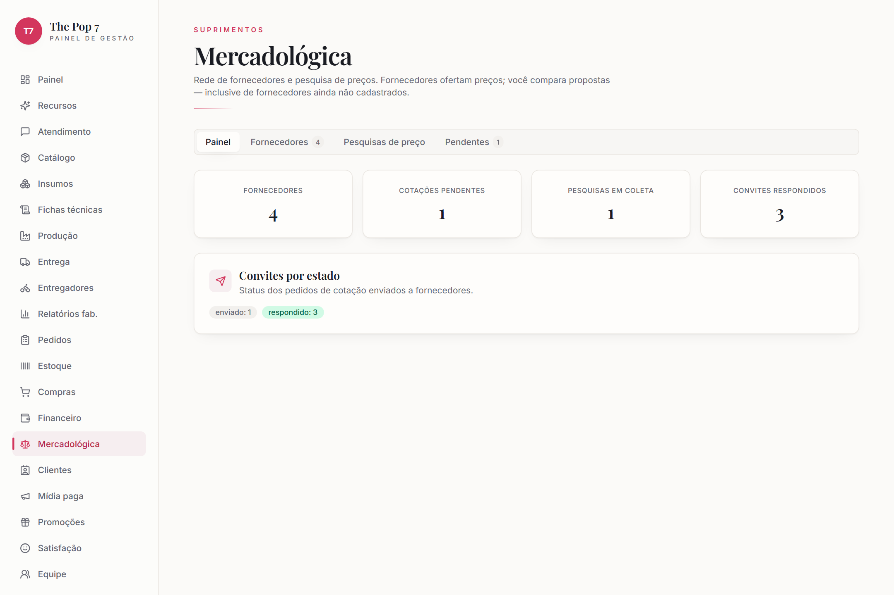

### 9.1 Compras (reposição)
- [ ] **Compras** → gerar pedidos de reposição a partir do estoque.

**Destrava:** controle do que repor antes de furar estoque.

🖱️ Passo a passo

<ol>
<li>No menu lateral, clique em <b>Compras</b>.</li>
<li>Gere um <b>pedido de reposição</b> a partir dos itens em falta no estoque.</li>
</ol>

### 9.2 Mercadológica (rede de fornecedores + cotação) — 🟢 nativo
- [ ] **Mercadológica → Fornecedores** (cadastrar).
- [ ] Abrir **pesquisa de preços** → capturar ofertas (form, manual, IA por texto/anexo PDF/imagem/CSV, WhatsApp ou e-mail) → enviar o link público `/cotacao/:token`.

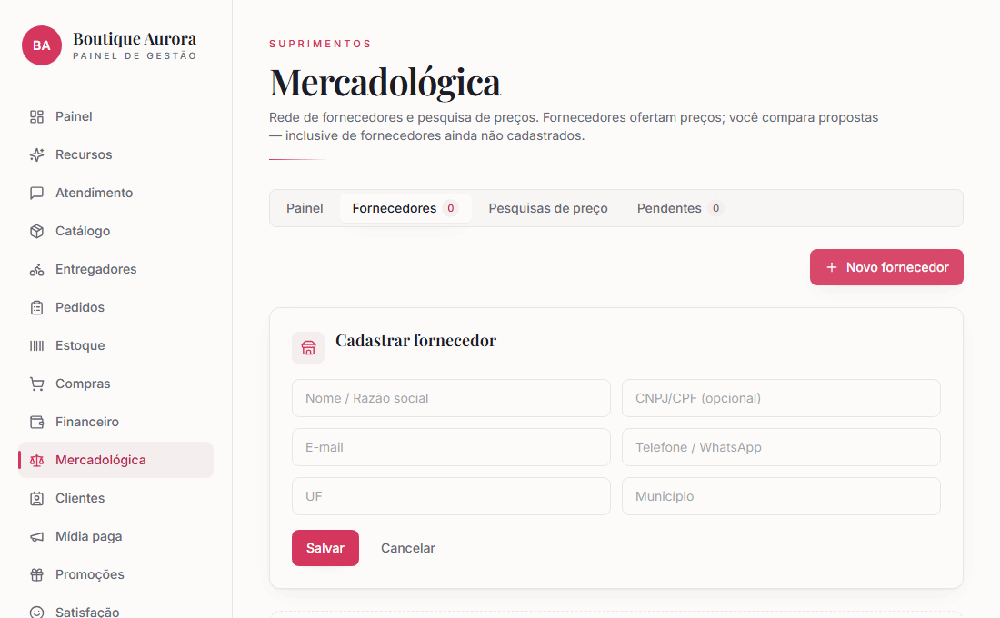

**Destrava:** **mapa comparativo** de preços consolidado + reenvio automático de cobrança de cotação.

🖱️ Passo a passo

<ol>
<li>No menu lateral, <b>Mercadológica</b> → aba <b>"Fornecedores"</b>.</li>
<li>Clique <b>"Novo fornecedor"</b> → razão social/contato → <b>"Salvar"</b>.</li>
<li>Abra uma <b>pesquisa de preços</b>, capture as ofertas e envie o <b>link de cotação</b>.</li>
<li>Veja o <b>mapa comparativo</b> e decida a compra.</li>
</ol>

✅ **Ao fim:** decisão de compra por preço comparado, não por achismo.

---

## Parte 10 — Financeiro

> **Enxergar o caixa** sem planilha paralela. *(Acesso: dono/admin.)*

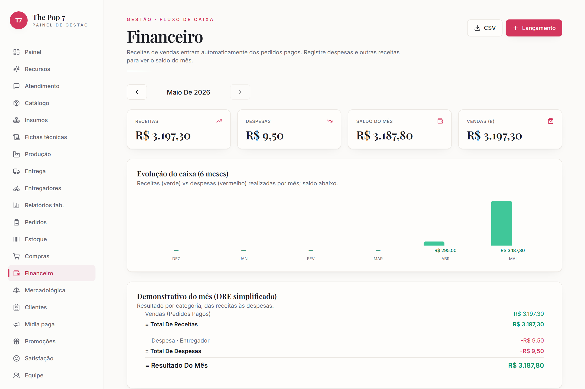

### 10.1 Fluxo de caixa — 🟢 nativo
- [ ] **Financeiro** → navegar por mês. A **receita de vendas é automática**; lance só **despesas e outras receitas**.

**Destrava:** saldo do mês = vendas + receitas − despesas, com cards e DRE.

🖱️ Passo a passo

<ol>
<li>No menu lateral, clique em <b>Financeiro</b>.</li>
<li>Navegue pelo <b>mês</b> com as setas (a receita de vendas entra sozinha).</li>
<li>Para uma despesa/receita manual: <b>"Lançamento"</b> → valor + descrição → <b>"Adicionar"</b>.</li>
</ol>

### 10.2 Contas a pagar/receber
- [ ] Lançar entradas com vencimento e status; **baixar** quando quitar.

**Destrava:** contas em aberto, alerta de **vencidas** (também no Painel) e exportação **CSV**.

🖱️ Passo a passo

<ol>
<li>Em <b>Financeiro</b>, no lançamento informe <b>vencimento</b> e <b>status</b> (pago/pendente).</li>
<li>Na lista <b>"Contas em aberto"</b>, clique <b>"Baixar"</b> ao quitar.</li>
<li>O botão <b>"CSV"</b> exporta tudo para a contabilidade.</li>
</ol>

### 10.3 Evolução
- [ ] Ver o gráfico de **6 meses**.

**Destrava:** leitura de tendência do negócio.

🖱️ Passo a passo

<ol>
<li>Em <b>Financeiro</b>, role até o gráfico <b>"Evolução do caixa (6 meses)"</b>.</li>
</ol>

✅ **Ao fim:** o caixa fica visível; taxas dos entregadores (4.4) entram sozinhas como despesa.

---

## Parte 11 — Fiscal & ERP

> Conectar com a **gestão** e emitir **nota fiscal**.

### 11.1 Tray Commerce (ERP / catálogo) — 🟡 Aguardando credencial
- [ ] **Configurações → Tray Commerce** → conectar (`ERP_PROVIDER=tray`, `TRAY_CONSUMER_KEY/SECRET`, `TRAY_API_URL`, `TRAY_ACCESS_TOKEN`).

**Destrava:** catálogo/estoque/pedidos **sincronizados** com o ERP que a loja já usa. *(Alternativas: Bling/Omie/VHSYS.)*

🖱️ Passo a passo

<ol>
<li>Configurações → card <b>"Tray Commerce (ERP / catálogo)"</b>.</li>
<li>Clique <b>"Conectar"</b> e autorize com a credencial da loja (Consumer Key/Secret).</li>
<li>Clique <b>"Salvar"</b>. Catálogo/estoque/pedidos passam a <b>sincronizar</b>.</li>
</ol>

### 11.2 CPlug (NFe / fiscal) — 🟡 Aguardando credencial
- [ ] **Configurações → CPlug** → conectar (`FISCAL_PROVIDER=cplug`, `CPLUG_*`).

**Destrava:** **emissão de NF-e automática** ao pagar (idempotente; não desfaz a venda se falhar).

🖱️ Passo a passo

<ol>
<li>Configurações → card <b>"CPlug (NFe / gestão fiscal)"</b>.</li>
<li>Cole <b>API URL</b>, <b>Client ID/Secret</b> e <b>usuário/senha</b> da loja → <b>"Salvar"</b>.</li>
<li>A <b>NF-e</b> passa a ser emitida automaticamente ao pagar.</li>
</ol>

✅ **Ao fim:** venda assistida e back-office fiscal/ERP na mesma língua.

---

## Parte 12 — Fabricação *(opcional)*

> Só aparece se o **Tipo de negócio** ligou produção (1.2). Para quem **produz**.

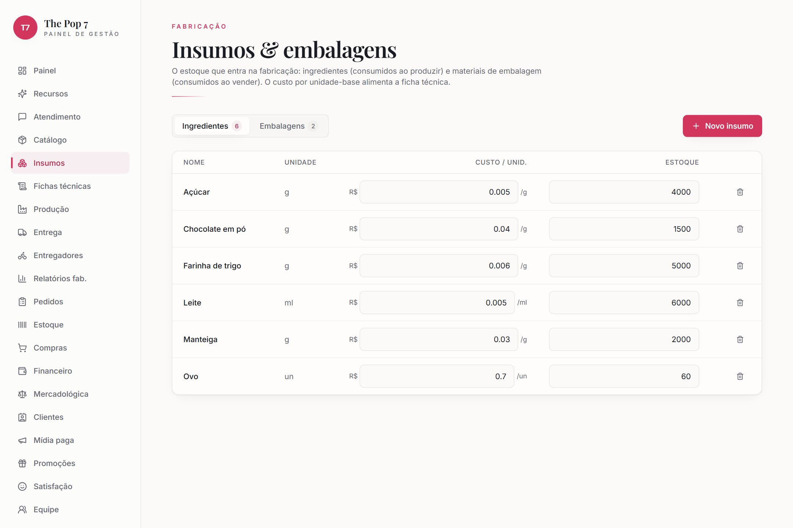

### 12.1 Insumos — 🟢 nativo
- [ ] **Insumos** → cadastrar matérias-primas e estoque.

**Destrava:** base de custo e controle do que é consumido.

🖱️ Passo a passo

<ol>
<li>No menu lateral, clique em <b>Insumos</b>.</li>
<li>Clique <b>"Novo insumo"</b> → nome, unidade, custo e estoque → <b>"Salvar"</b>.</li>
</ol>

### 12.2 Fichas técnicas (receitas)
- [ ] **Fichas técnicas** → montar a receita de cada produto (insumo × quantidade).

**Destrava:** custo real por produto e baixa correta de insumos.

🖱️ Passo a passo

<ol>
<li>No menu lateral, clique em <b>Fichas técnicas</b>.</li>
<li>Escolha o produto e adicione <b>insumo × quantidade</b>.</li>
<li>Clique <b>"Salvar"</b> — fica o custo real e a baixa correta dos insumos.</li>
</ol>

### 12.3 Produção
- [ ] **Produção** → registrar uma produção → **dá baixa nos insumos** e gera o acabado. **Relatórios fab.** mostram o resultado.

**Destrava:** insumo → produto vendável com rastreio de custo e consumo.

🖱️ Passo a passo

<ol>
<li>No menu lateral, clique em <b>Produção</b>.</li>
<li>Clique <b>"Registrar produção"</b> → produto + quantidade → confirme.</li>
<li>O sistema <b>dá baixa nos insumos</b> e soma o acabado. Veja o resultado em <b>Relatórios fab.</b>.</li>
</ol>

✅ **Ao fim:** a cadeia produção → estoque → venda fecha ponta a ponta.

---

## Parte 13 — Equipe & governança

> **Quem pode o quê** e **conformidade**.

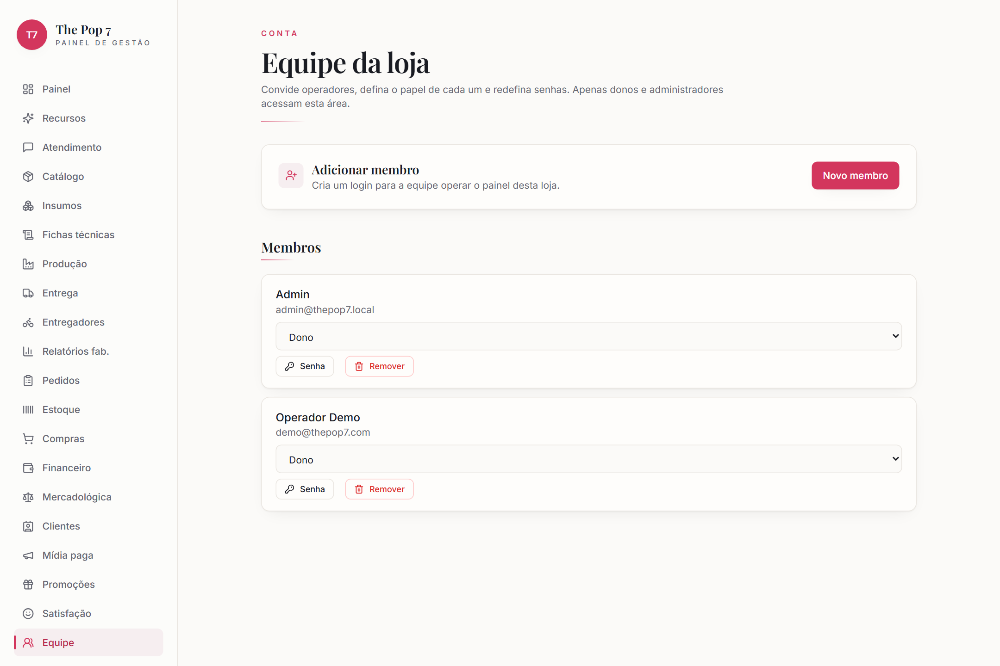

### 13.1 Equipe (papéis) — 🟢 nativo
- [ ] **Equipe** → convidar pessoas e definir papel (dono, admin, gestão, atendente).

**Destrava:** acesso por papel — Financeiro/gestão só para quem deve; atendentes no Inbox.

🖱️ Passo a passo

<ol>
<li>No menu lateral, clique em <b>Equipe</b>.</li>
<li>Clique <b>"Novo membro"</b> → nome, e-mail, <b>papel</b> (Operador/Administrador) e senha → confirmar.</li>
<li>Para trocar o papel, use o seletor no card da pessoa. (Só o <b>dono</b> redefine senha.)</li>
</ol>

### 13.2 Retenção de dados (LGPD)
- [ ] **Configurações → Retenção de dados (LGPD)** → definir prazo; atender pedidos de exclusão.

**Destrava:** conformidade legal (apagar dados pessoais sob demanda, respeitando o isolamento por loja).

🖱️ Passo a passo

<ol>
<li>Configurações → card <b>"Retenção de dados (LGPD)"</b>.</li>
<li>Defina o <b>prazo</b> de retenção → <b>"Salvar"</b>.</li>
<li>Pedido de exclusão de dados: atenda pelo cadastro do cliente.</li>
</ol>

### 13.3 Identidades cross-canal
- [ ] **Configurações → Identidades cross-canal** → unificar o mesmo cliente por telefone/Instagram/e-mail/CPF/nome parecido.

**Destrava:** cliente que fala por vários canais vira **uma pessoa só** no CRM (histórico, cashback e perfil consolidados).

🖱️ Passo a passo

<ol>
<li>Configurações → card <b>"Identidades cross-canal"</b>.</li>
<li>Reveja as sugestões de <b>mesmo cliente</b> (telefone/IG/e-mail/CPF).</li>
<li>Confirme o <b>merge</b> para unificar o histórico numa pessoa só.</li>
</ol>

✅ **Ao fim:** operação segura, papéis claros e cada cliente como identidade única.

---

## Parte 14 — Painel de TV (ao vivo) — 🟢 nativo

> Um **wallboard** de tela cheia pra deixar rodando numa TV (32"+) e acompanhar a
> operação do dia de relance. Atualiza sozinho a cada 12 segundos.

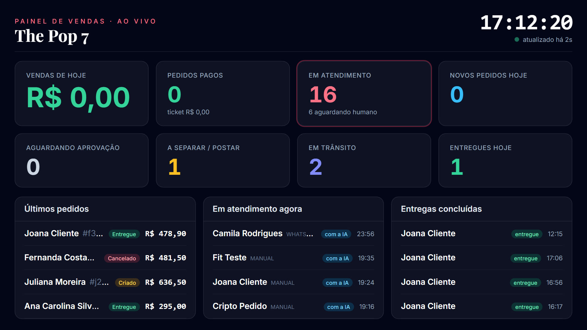

### 14.1 Abrir o painel
- [ ] **Configurações → Painel de TV (ao vivo) → "Abrir painel agora"** (abre `/tv` logado).

**Mostra, em tempo real:** vendas e pedidos pagos do dia (com ticket médio) • **gente em atendimento** (e quantos aguardam um humano, em destaque) • **aguardando aprovação** e aguardando pagamento • fila de entrega (**a separar/postar**, **em trânsito**, **entregues hoje**) • e as listas de **últimos pedidos**, **em atendimento agora** e **entregas concluídas**.

🖱️ Passo a passo

<ol>
<li>Configurações → card <b>"Painel de TV (ao vivo)"</b>.</li>
<li>Clique <b>"Abrir painel agora"</b> (abre o wallboard numa nova aba).</li>
</ol>

### 14.2 Link público para a TV (sem login)
- [ ] **Configurações → Painel de TV → "Ativar link público da TV"** → copiar o link.
- [ ] Abrir esse link no navegador da Smart TV — fica atualizando sozinho, **sem precisar logar**.

**Destrava:** a TV roda o painel de forma autônoma. "Gerar novo" revoga o link anterior; "Desativar" remove o acesso público. *(Gestão do link: só dono/admin.)*

🖱️ Passo a passo

<ol>
<li>Configurações → card <b>"Painel de TV"</b>.</li>
<li>Clique <b>"Ativar link público da TV"</b> e depois <b>"Copiar link"</b>.</li>
<li>Na Smart TV, abra o link no navegador e deixe rodando.</li>
<li><b>"Gerar novo"</b> troca o link; <b>"Desativar"</b> remove o acesso público.</li>
</ol>

✅ **Ao fim:** a loja inteira enxerga o pulso do dia numa tela — vendas, atendimento e entregas — sem ninguém precisar abrir relatório.

---

## Resumo da jornada

**Fundação** liga a IA → **Canais** trazem o cliente → **Catálogo** dá o que vender →
**Pagamento/Entrega** fecha e entrega → **Atendimento/Pedidos** opera o dia a dia →
**Marketing** traz de volta → **Pós-venda** cuida → **Perfis** personalizam →
**Compras** baratea → **Financeiro** controla → **Fiscal/ERP** formaliza →
**Fabricação** (se produz) → **Governança** protege.

Cada parte só entrega o máximo quando as anteriores estão alimentadas. O sistema
funciona mesmo incompleto (o **modo mock** cobre o que faltar), mas o **valor total**
vem do conjunto.

---

## Glossário

| Termo | O que é |
|-------|---------|
| **Maya / Bia / Lia** | As personas de IA da loja. **Maya** atende e vende nas conversas; **Bia** cuida das cotações com fornecedores; **Lia** faz o pós-venda (D+1/D+7/D+14/D+30). |
| **Tenant / loja** | Cada loja é um espaço isolado. Os dados de uma nunca se misturam com os de outra. |
| **Segmento** | O tipo de negócio (moda, alimentação…). Define o vocabulário do catálogo, a voz da IA e se a Fabricação aparece. |
| **Inbox / Atendimento** | A caixa única onde caem todas as conversas (WhatsApp, Instagram, Facebook). |
| **Handoff / "aguardando humano"** | Quando a IA passa a conversa para uma pessoa (cliente pediu, perfil "atenção humana", detrator de NPS, ou pedido acima do teto). |
| **Teto de auto-aprovação** | Valor até o qual a Maya fecha a venda sozinha. Acima dele, o pedido espera aprovação de um atendente. |
| **Cashback** | % da compra que volta como saldo pro cliente usar depois. A Maya lembra o cliente do saldo. |
| **NPS / detrator** | Nota de satisfação (0–10). Quem dá nota baixa (**detrator**) é encaminhado automaticamente para um humano recuperar. |
| **Recompra / winback** | Reativação automática de quem comprou e ficou inativo. |
| **Padrão de código** | Formato próprio de código de barras/QR das etiquetas (ex.: `26030104159030-0001-PP`), com significado legível. |
| **Peça** | Cada item físico único registrado por etiqueta — permite contar o estoque por tamanho e dar baixa por leitura. |
| **Mercadológica** | Rede de fornecedores + pesquisa de preços (cotação) com mapa comparativo. |
| **Wallboard / Painel de TV** | A tela ao vivo da operação do dia, feita pra rodar numa TV. |
| **Modo mock** | Quando uma integração não tem credencial, o sistema **simula** o serviço pra você testar o fluxo. |
| **RLS / isolamento** | Mecanismo que garante que cada loja só enxerga os próprios dados. |
| **LGPD** | Lei de proteção de dados — consentimento, opt-out e exclusão sob demanda. |
| **ERP / NFe** | Sistema de gestão (Tray/Bling/Omie/VHSYS) e nota fiscal eletrônica (CPlug). |

---

## Papéis e permissões

Três papéis (definidos em **Equipe**). A coluna diz quem **consegue** fazer.

| Área | Dono | Administrador | Operador |
|------|:----:|:-------------:|:--------:|
| Atendimento (Inbox), assumir conversas | ✅ | ✅ | ✅ |
| Pedidos (ver, aprovar, simular entrega, pós-venda) | ✅ | ✅ | ✅ |
| Catálogo, Estoque, Clientes | ✅ | ✅ | ✅ |
| Promoções, Satisfação, Compras, Mercadológica | ✅ | ✅ | ✅ |
| Entregadores (roster e corridas) | ✅ | ✅ | ✅ |
| **Configurações & integrações** (conectar canais, pagamento, ERP…) | ✅ | ✅ | ❌ |
| **Financeiro** (caixa, contas, DRE) | ✅ | ✅ | ❌ |
| **Equipe** (convidar, definir papel) | ✅ | ✅ | ❌ |
| **Redefinir senha** de membros | ✅ | ❌ | ❌ |
| **Painel de TV** — abrir | ✅ | ✅ | ✅ |
| **Painel de TV** — ativar/revogar o link público | ✅ | ✅ | ❌ |

> **Operador** opera o dia a dia (vende, atende, separa, entrega) sem mexer em
> conta, dinheiro ou configuração. **Administrador** faz tudo isso. **Dono** é o
> único que redefine senhas dos outros.

---

## Perguntas frequentes (FAQ)

**A IA responde sem eu conectar o WhatsApp?**
Ela já está pronta (🟢 Anthropic LIVE), mas só *responde a clientes* depois que um
canal (WhatsApp/Instagram) está conectado. Sem credencial, dá pra testar tudo no
**modo mock**.

**Preciso preencher todas as integrações para vender?**
Não. O mínimo é **canal + 1 produto + pagamento** (veja [Primeiros 30 minutos](./primeiros-30-min.md)).
O resto entra aos poucos; o que faltar roda em mock.

**A Maya fecha qualquer venda sozinha?**
Só até o **teto de auto-aprovação**. Acima dele, o pedido fica "Aguardando aprovação"
em **Pedidos** pra um atendente liberar.

**Como deixo a IA mais "dura" com um cliente difícil?**
Em **Clientes → ⚙ Perfil**, marque a tag (pechincheiro, problemático…). "Banido"
faz a IA não atender; "Requer atendimento humano" encaminha direto pra uma pessoa.

**O cliente que chama vira cadastro sozinho?**
Sim — quem chama pelo WhatsApp/Instagram entra no CRM já com o nome do perfil e o
canal de origem. Você completa endereço/CPF depois em **Clientes**.

**Posso deixar o Painel de TV numa TV sem login?**
Sim. **Configurações → Painel de TV → Ativar link público** e abra o link na TV.
"Gerar novo" revoga o anterior.

**Uma loja consegue ver dados de outra?**
Não. Cada loja é isolada; toda consulta é filtrada pela loja. (Há testes
automatizados garantindo isso a cada deploy.)

**Apareceu "modo mock" / um valor simulado — está quebrado?**
Não. É a integração ainda sem credencial rodando simulada. Conecte a credencial
em **Configurações** para usar o serviço real.

**Como sei o que já está conectado de verdade?**
Pela tabela [Painel de integrações](#painel-de-integrações--o-que-ligar-e-status-atual)
(gerada do status real) e pelos badges 🟢/🟡/⚪ em cada passo.
